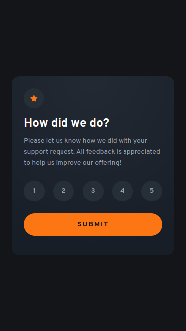
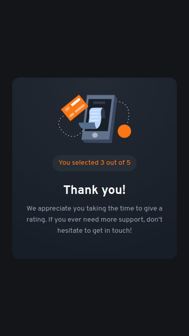

# Frontend Mentor | Interactive rating component

This is my solution to the [Interactive rating component challenge](https://www.frontendmentor.io/challenges/interactive-rating-component-koxpeBUmI) from [Frontend Mentor](https://www.frontendmentor.io/).

## Links

- [Live website](https://fem-interactive-rating-component-jgerard.vercel.app)
- [Solution](https://www.frontendmentor.io/solutions/interactive-rating-component-with-angular-18-8yiOxFkmG7)
- [Challenge](https://www.frontendmentor.io/challenges/interactive-rating-component-koxpeBUmI)
- [Lighthouse report](https://googlechrome.github.io/lighthouse/viewer/?gist=435b28e5a1bcbc19fa0d1419223d6346)

## Tech Stack

### Frontend

- [Angular 18](https://blog.angular.dev/angular-v18-is-now-available-e79d5ac0affe)
- [Sass](https://sass-lang.com/)

### Backend

- [Vercel](https://vercel.com/) (static hosting)

## Key Features

- Angular animations
- [Model inputs](https://angular.dev/guide/signals/model) (preview)
- [Built-in control flow](https://angular.dev/guide/templates/control-flow) (stable)

## Automated Tasks

- Project initialization with shell script
- Vercel deployments:
  - [Preview](.github/workflows/vercel-preview.yaml)
  - [Production](.github/workflows/vercel-production.yaml)
- [CodeQL analysis](https://codeql.github.com/) (see [workflow](.github/workflows/codeql.yaml))

## Environment & Tools

- System: [Ubuntu](https://ubuntu.com/) (GNU/Linux)
- IDE: [Visual Studio Code](https://code.visualstudio.com/)
- Design: [Figma](https://www.figma.com/)

## VS Code Extensions

- [Angular Language Service](https://marketplace.visualstudio.com/items?itemName=angular.ng-template)
- [Prettier - Code formatter](https://marketplace.visualstudio.com/items?itemName=esbenp.prettier-vscode)
- [ESLint](https://marketplace.visualstudio.com/items?itemName=dbaeumer.vscode-eslint) (not yet available for Angular v18, see https://github.com/angular-eslint/angular-eslint/pull/1830)
- [GitHub Copilot](https://marketplace.visualstudio.com/items?itemName=github.copilot) (active subscription required)

## Screenshots (Mobile)

## About Frontend Mentor

[Frontend Mentor](https://www.frontendmentor.io/) challenges help you improve your coding skills by building realistic projects.

## Copyright

© 2024 Johnny Gérard
